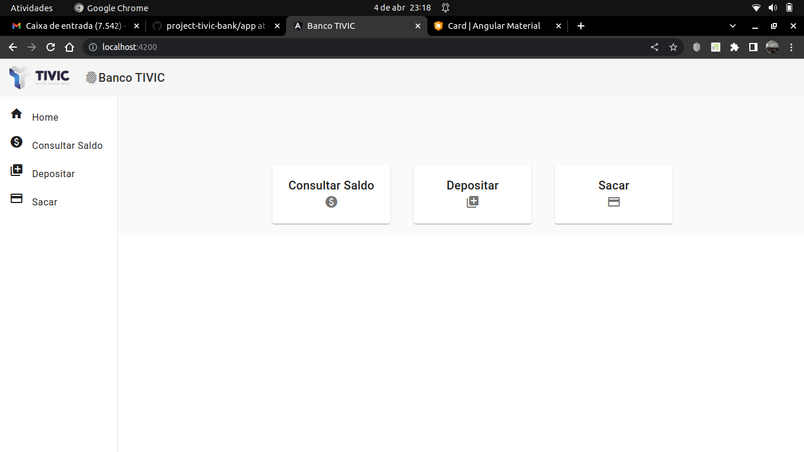
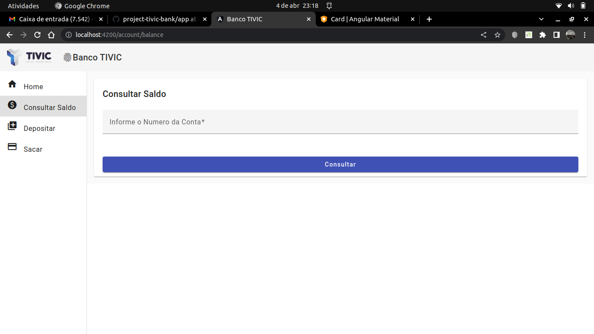
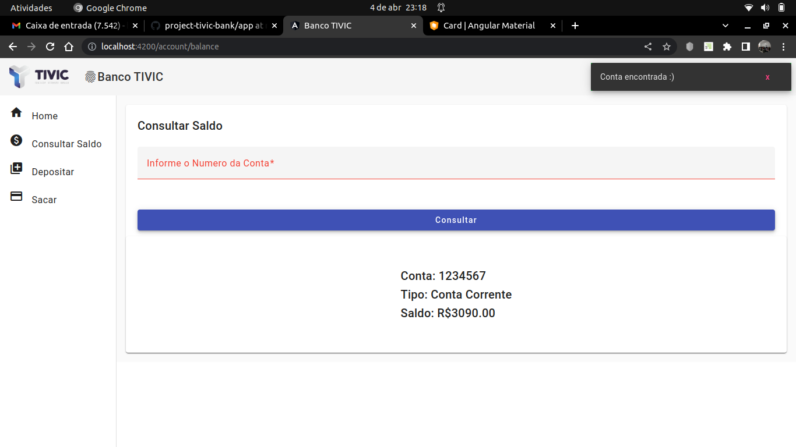
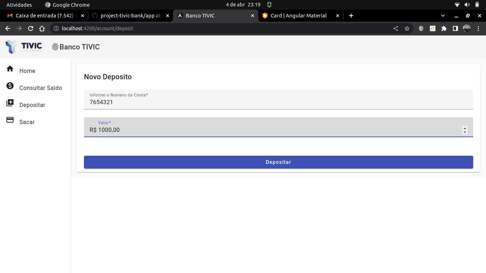
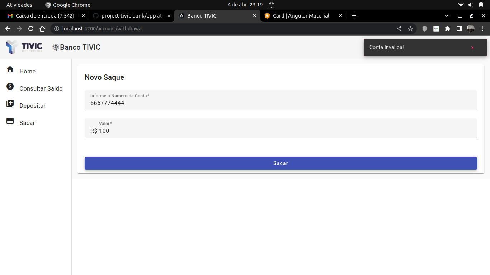

# Projeto Banco TIVIC!

<details>
<summary><strong>👨‍💻 Telas</strong></summary><br />

  **Tela Home**
  

  **Tela Consultar Saldo**
  

  **Tela Consultar Saldo - Mostrando Saldo**
  

  **Tela de Deposito**
  

  **Tela de Saque - Simulando Conta Errada**
  


</details>

<details>
<summary><strong> Informações sobre implementação e Estrutura do projeto </strong></summary><br />


<strong>Informações sobre implementação</strong>


1️⃣  **Arquitetura Utilizada**

- A arquitetura utilizada no problema proposto foi a arquitetura MVC (Model-View-Controller) no backend com NodeJs e Angular no frontend. A arquitetura MVC separa as responsabilidades das diferentes partes da aplicação web, sendo o modelo responsável por representar os dados e a lógica de negócio, a visão responsável por exibir as informações e o controlador responsável por intermediar a comunicação entre o modelo e a visão. O Angular, por sua vez, é um framework de desenvolvimento web que utiliza a arquitetura de componentes, onde cada componente é responsável por uma parte da interface do usuário e sua lógica de negócio, por ser a primeira vez que utilizo o Agular não sei especificar se seguir um padrão no front-end.

2️⃣ **Problema Relevante**
- Houve um problema relevante com o CROS (Cross-Origin Resource Sharing) na implementação do backend em Node.js. O CROS é uma política de segurança implementada pelos navegadores para evitar que scripts mal-intencionados acessem recursos de outros domínios. O problema ocorreu quando o frontend, rodando em um domínio diferente, tentou acessar recursos no backend, o que causou um erro de CROS.

- Para solucionar esse problema, foi necessário habilitar o CROS no servidor Node.js por meio de pacotes de middleware, o cors. Esses pacote permite configurar o servidor para permitir o acesso a recursos de outros domínios, garantindo a segurança da aplicação. Dessa forma, foi possível resolver o problema de CROS e permitir que o frontend acessasse os recursos do backend sem erros.


<strong>O projeto é composto de 4 entidades importantes para sua estrutura</strong>


1️⃣ **Banco de dados:**
  - Será um container docker MySQL já configurado no docker-compose através de um serviço definido como `db`.
  - Tem o papel de fornecer dados para o serviço de _backend_.
  - Você também pode conectar a um Cliente MySQL (Workbench, Beekeeper, DBeaver e etc), colocando as credenciais configuradas no docker-compose no serviço `db`.

2️⃣ **Back-end:**
 - Deve rodar na porta `3000`, pois o front-end vai fazer as requisições para ele nessa porta;

3️⃣ **Front-end:**
  - O front se comunica com serviço de back-end pela url `http://localhost:3000` através dos endpoints construidos.

4️⃣ **Docker:**
  - O `docker-compose` tem a responsabilidade de unir os serviços conteinerizados (backend e db) e subir o projeto completo com o comando `npm run compose:up` ou `npm run compose:up:dev`;

</details>

# Orientações

<details>
<summary><strong> 🔰 Iniciando o projeto</strong></summary><br />

  1. Clone o repositório `Usar link SSH`

- Entre na pasta do repositório que você acabou de clonar:
  * `cd project-tivic-bank`
  * --> `cd app/backend` para acessar o Back-End
  * --> `cd app/frontend/tivic-bank-frontend` para acessar o Front-End

  2. Instale as dependências, em ambos os diretorios
  * `npm install`


</details>

<details>
<summary><strong> ⚠️ Configurações mínimas para execução do projeto</strong></summary><br />

Na sua máquina você deve ter:

 - Sistema Operacional Distribuição Unix
 - Node versão 16
 - Docker
 - Docker-compose versão >=1.29.2

➡️ O `node` deve ter versão igual ou superior à `16.14.0 LTS`:
  - Para instalar o nvm, [acesse esse link](https://github.com/nvm-sh/nvm#installing-and-updating);
  - Rode os comandos abaixo para instalar a versão correta de `node` e usá-la:
    - `nvm install 16.14 --lts`
    - `nvm use 16.14`
    - `nvm alias default 16.14`

➡️ O`docker-compose` deve ter versão igual ou superior à`ˆ1.29.2`:
  * Use esse [link de referência para realizar a instalação corretamente no ubuntu](https://app.betrybe.com/learn/course/5e938f69-6e32-43b3-9685-c936530fd326/module/94d0e996-1827-4fbc-bc24-c99fb592925b/section/5987fa2d-0d04-45b2-9d91-1c2ffce09862/day/2f1a5c4d-74b1-488a-8d9b-408682c93724/lesson/b883b81d-21f6-4b60-aa62-8508f6017ea0);
  * Acesse o [link da documentação oficial com passos para desinstalar](https://docs.docker.com/compose/install/#uninstallation) caso necessário.

</details>

<details>
<summary><strong>🐳 Configuração Docker</strong></summary><br />

  ### Docker e Docker-compose

  ⚠ O docker-compose precisa estar na versão 1.29 ou superior.  ⚠
[Veja aqui a documentação para atualizar o docker-compose.](https://docs.docker.com/compose/install/)

</details>


## Desenvolvimento

<details id='Variaveis-de-ambiente'>
<summary><strong> ⚙️ Variáveis de ambiente </strong></summary><br />

  **No diretório `/` renomeie o arquivo `.env.example` para `.env` e configure os valores de acordo com o cenário do seu ambiente (credenciais de banco de dados, secrets desejadas e etc)**. Isso vai permitir que você inicialize a aplicação fora do _container_ e ela se conecte com seu banco local caso deseje.
 > `./env.example`
  ```txt
  MYSQL_USER=root
  MYSQL_PASSWORD=sua_senha
  MYSQL_DATABASE=tivic_bank_db
  MYSQL_HOST="127.0.0.1"
  MYSQL_DIALECT=mysql
  MYSQL_PORT=3306
  HOSTNAME=localhost
  PORT=3001
  API_PORT=3000
  ```

</details>

<details id='sequelize'>
  <summary><strong>🎲 Sequelize</strong></summary>
  <br/>

  ⚠️ O `package.json` do diretório `/` contém um script `db:reset` que é responsável por "dropar" o banco, recriar e executar as _migrations_ e _seeders_. Você pode executá-lo com o commando `npm run db:reset` se por algum motivo precisar recriar a base de dados;

  ⚠️ **O sequelize já foi inicializado, portanto NÃO é necessário executar o `sequelize init` novamente**

</details>
